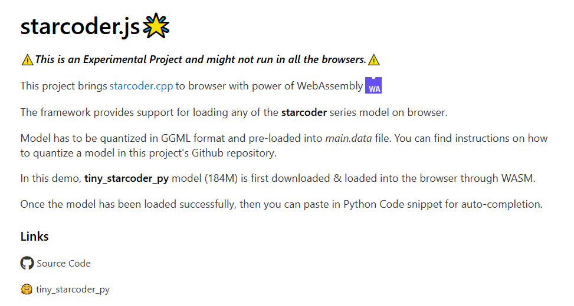
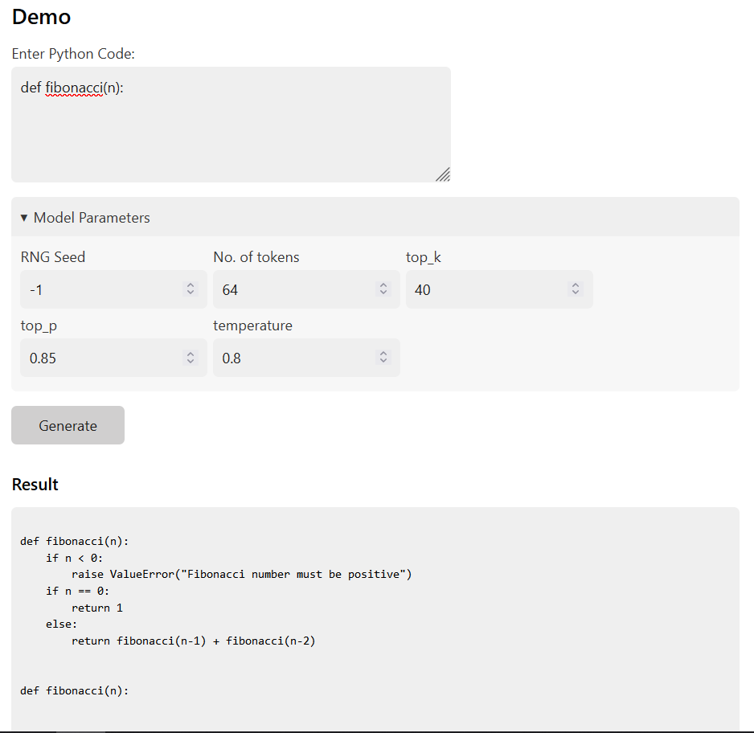
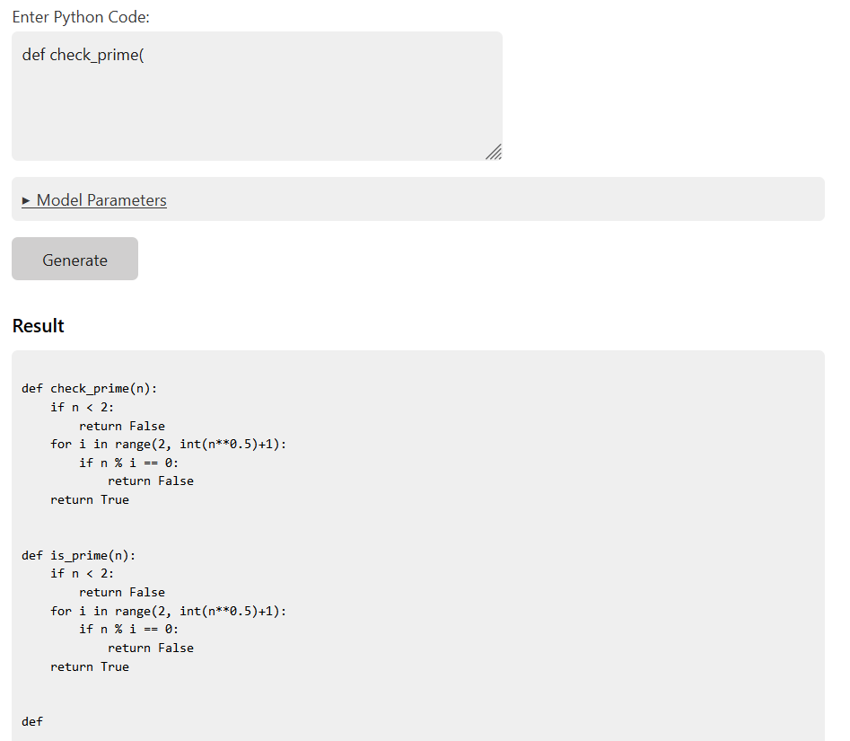
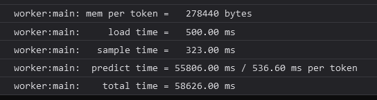

# 💫StarCoder.js *\*Experimental*\*

[](https://badge.fury.io/js/starcoder.js)


`THIS IS UNDER DEVELOPMENT AND IS NOT PRODUCTION READY. BROWSER REQUIRES MEM64 SUPPORT TO RUN THIS PROJECT`

This project brings [starcoder.cpp](https://github.com/bigcode-project/starcoder.cpp) to browser with power of WebAssembly.

## Demo

Web Application : [starcoder.js](https://rahuldshetty.github.io/starcoder.js/)





### Performance




Following performance speed is captured on Firefox Nightly with following system configuration:
* CPU: Intel(R) Core(TM) i7-8750H CPU @ 2.20GHz
* Memory: 24GB



# Build Instructions

```
git clone https://github.com/bigcode-project/starcoder.cpp
cd starcoder.cpp

Run the notebook in examples/ to convert starcoder model to GGML format.

# Builds JS/WASM dependency in build/ location
build.sh

# Generate Distributable JS
npm run build

# To publish to NPM
npm publish
```